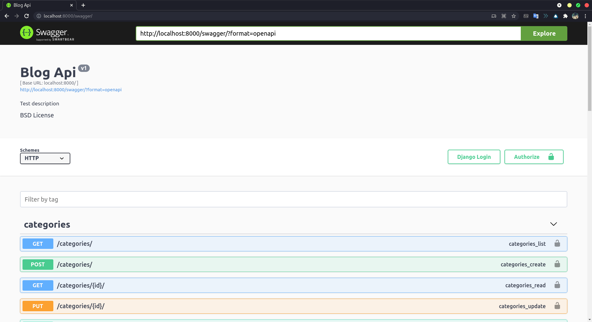

# README #

This README would normally document whatever steps are necessary to get your application up and running.

### About ###
* Тестовое задание

### Prerequisites ###
* Python > 3.9
* Django 3.2.7
* PostgreSQL 13.3
* Virtualenv

### Разворачивание для разработки (docker) ###
`docker-compose build`  
`docker-compose up`

### Документация ###
Документация доступна по ссылке
`http://localhost:8000/swagger/`

По умолчанию создается пользователь с ником `admin` и паролем `admin`.
